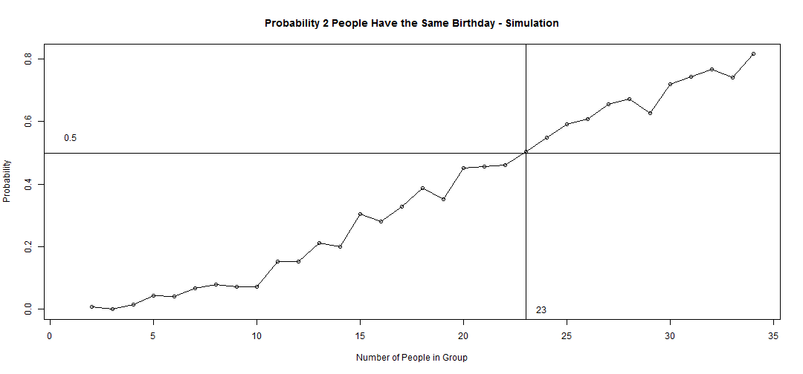

Birthday Problem App
========================================================
author: Sven Boekhoven
date: 2015-02-22
transition: fade
font-family: 'Helvetica'

Birthday Problem
========================================================

The [birthday problem](http://en.wikipedia.org/wiki/Birthday_problem) is  as follows:  

*Given the probability and the number of people  you want to have their birthday on the same day, how large should the group of people need to be?*
- probability 50%, 2 on the same day: 23 people
- probability 95%, 5 on the same day: 444 people

For a lot of people it is hard to believe the group size is that small for the probability. The birthday problem app is to show that the theoretical can be explained by simulation.

The Birthday Problem App
========================================================

The App can be used to calculate the theoretical group size with different probabilities and coincidents and simulate the group size for comparison.  

The App uses three inputs:
- Probability: Sets the probability you wish to calculate the group size for.
- Coincidents: Sets the number of people that should have their birthday on the same day.
- Number of simulations: How many simulations should be run to calculate the group size.

Theoretical
========================================================

Using `qbirthday` the group size can be determined. For the two examples on the second slide:

```r
qbirthday(0.5, 365, 2)
```

```
[1] 23
```

```r
qbirthday(0.95, 365, 5)
```

```
[1] 444
```

Simulation
========================================================
Using a simulation the (approximately) same result can be obtained proving the theoretical calculation is correct.  
 
